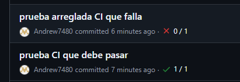
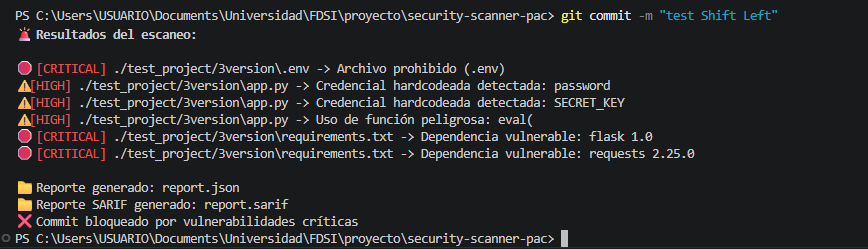
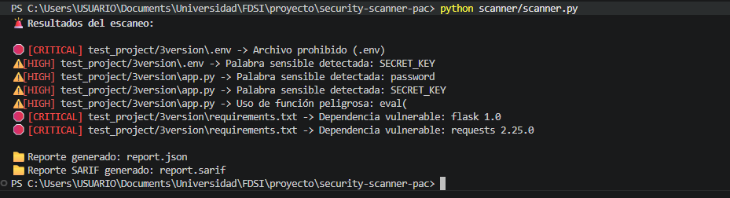
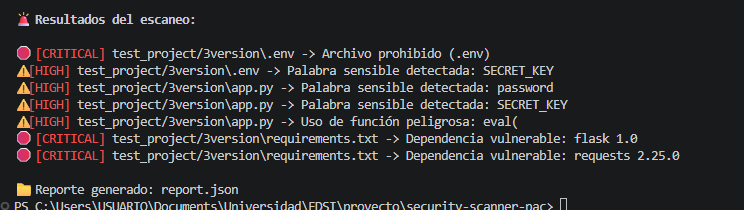
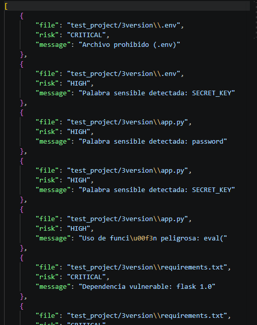
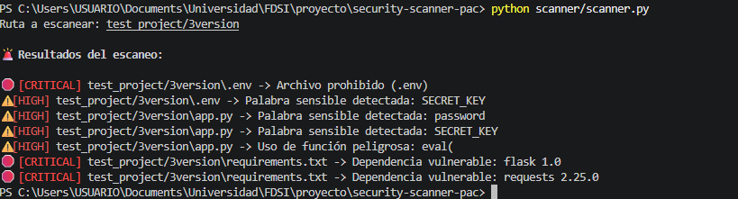
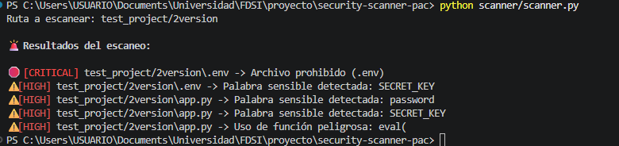
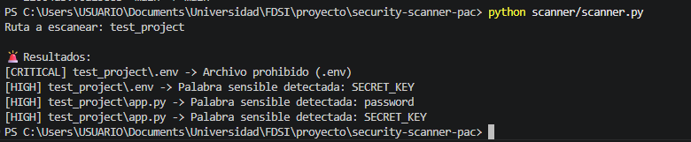

# security-scanner-pac

## Descripción

**security-scanner-pac** es una herramienta para escanear proyectos en busca de archivos y contenidos potencialmente inseguros, basada en políticas configurables y fácilmente extensible.

## Justificación y Marco Teórico

La exposición accidental de contraseñas, claves privadas y otra información sensible dentro del código fuente representa una de las vulnerabilidades más comunes en el desarrollo de software. Este proyecto surge para demostrar cómo la seguridad puede integrarse directamente en el proceso de desarrollo mediante enfoques automatizados, aplicando el paradigma de "Policy as Code" (PaC) y el principio de "Shift Left" en DevSecOps.

Puedes consultar el documento completo con toda la teoría y justificación aquí:

1. [Justificación y Marco Teórico del Proyecto](https://pruebacorreoescuelaingeduco-my.sharepoint.com/:w:/g/personal/andres_cardozo-m_mail_escuelaing_edu_co/IQD3YREPCx0MQ6D38vMMeQDsAVGpAF3P8Z0GIh48NKdF4DU?e=9IhLpY)

### Resumen de la teoría

- **Security as Code (SaC):** Define y ejecuta controles de seguridad mediante código, permitiendo automatización, trazabilidad y consistencia.
- **Policy as Code (PaC):** Expresa políticas de seguridad como reglas programables evaluadas automáticamente.
- **Automatización de controles:** Permite validar seguridad en pipelines CI/CD y detectar secretos antes de producción.
- **Shift Left:** Lleva la seguridad a etapas tempranas del desarrollo, reduciendo costos y riesgos.
- **DevSecOps:** Integra la seguridad como parte continua y compartida en el ciclo de desarrollo.

El escáner implementa políticas como:
- Bloqueo de palabras sensibles (ej: password, SECRET_KEY)
- Bloqueo de archivos de configuración sensibles (.env)
- Restricción de tamaño de archivos

La arquitectura es modular y fácilmente integrable en pipelines CI/CD, permitiendo extender reglas sin modificar el código base.


## ¿Qué hace?

- Busca extensiones de archivo prohibidas (ej: `.env`)
- Detecta palabras sensibles en el contenido de los archivos (ej: `password`, `SECRET_KEY`)
- Verifica que los archivos no excedan un tamaño máximo definido
- Reporta los hallazgos con nivel de riesgo (CRITICAL, HIGH, MEDIUM)

## Estructura del proyecto

- `scanner/scanner.py`: Script principal del escáner.
- `policies.json`: Políticas de seguridad (palabras, extensiones y tamaño máximo).
- `test_project/`: Carpeta de ejemplo para pruebas.
- `docs/images/firstTest.png`: Imagen de ejemplo de la ejecución.

## Uso

1. Asegúrate de tener Python instalado.
2. Ejecuta el escáner desde la raíz del proyecto. Puedes pasar la ruta como argumento (recomendado para CI/CD y automatización):

	```
	python scanner/scanner.py test_project/
	```

	O bien, si no pasas argumento, el escáner te pedirá la ruta de forma interactiva:

	```
	python scanner/scanner.py
	# Luego ingresa la ruta cuando lo solicite
	```

Esto permite usar el escáner tanto en pipelines automáticos como de forma manual.

## Integración CI/CD con GitHub Actions

El proyecto incluye un workflow de GitHub Actions que ejecuta el escáner automáticamente en cada push o pull request. El pipeline falla si se detectan vulnerabilidades críticas (CRITICAL) y pasa si no hay problemas graves.

**¿Cómo funciona?**

- El workflow ejecuta:

	```yaml
	- name: Ejecutar Scanner
		run: |
			python scanner/scanner.py ./test_project/3version
	- name: Validar resultados
		run: |
			if grep -q "CRITICAL" report.json; then
				echo "❌ Vulnerabilidades críticas encontradas"
				exit 1
			else
				echo "✅ Sin vulnerabilidades críticas"
			fi
	```

- Si la carpeta escaneada contiene archivos o dependencias vulnerables (como en `test_project/3version`), el pipeline **falla**.
- Si la carpeta escaneada está limpia (como `test_project/test_que_pasa_ci`), el pipeline **pasa** correctamente.

**Ejemplo de uso:**

- Para probar que el pipeline falla, ejecuta el escáner sobre una carpeta con vulnerabilidades:

	```yaml
	python scanner/scanner.py ./test_project/3version
	```

- Para probar que el pipeline pasa, ejecuta el escáner sobre la carpeta limpia:

	```yaml
	python scanner/scanner.py ./test_project/test_que_pasa_ci
	```


**Prueba**




## Historial de versiones

### Versión 7 — Pre-commit hook (Shift Left real)

**¿Qué se agregó?**

- Un hook de pre-commit que ejecuta automáticamente el escáner antes de cada commit.
- Si se detectan vulnerabilidades críticas, el commit es bloqueado y no puede continuar.
- Esto implementa el principio Shift Left real: los problemas de seguridad se detectan y corrigen antes de llegar al repositorio.

**¿Cómo se usa?**

1. Crea el archivo `.git/hooks/pre-commit` con el siguiente contenido:

	```bash
	#!/bin/bash
	echo "🔍 Ejecutando scanner de seguridad..."
	python scanner/scanner.py ./test_project
	if grep -q "CRITICAL" report.json; then
		 echo "❌ Commit bloqueado por vulnerabilidades críticas"
		 exit 1
	fi
	echo "✅ Commit permitido"
	```

2. Da permisos de ejecución (en Linux/Mac):

	```bash
	chmod +x .git/hooks/pre-commit
	```

En Windows, el hook funciona si tienes Python y grep disponibles (por ejemplo, usando Git Bash).

**¿Qué logra esto?**

- Si hay vulnerabilidades críticas, el commit es bloqueado y se muestra un mensaje de error.
- Si no hay problemas, el commit se realiza normalmente.

¡Esto ayuda a prevenir la exposición de riesgos antes de subir código al repositorio!




### Versión 6 — Reducción de falsos positivos (detección avanzada)

**¿Qué se mejoró?**

- Ahora el escáner detecta credenciales hardcodeadas solo si realmente hay una asignación en el código (por ejemplo, `password = "algo"`), usando expresiones regulares (regex).
- Esto reduce drásticamente los falsos positivos, ya que no alerta por cualquier aparición de palabras sensibles, sino solo cuando representan un riesgo real.
- La detección de funciones peligrosas (`eval`, `exec`, etc.) ahora es insensible a mayúsculas/minúsculas.

**¿Por qué estos cambios?**

- Los falsos positivos pueden saturar y hacer que los desarrolladores ignoren alertas importantes.
- Usar regex permite identificar patrones de riesgo real, alineándose con prácticas de herramientas profesionales.

**Ejemplo de detección avanzada:**

Detecta:

```python
password = "123456"
SECRET_KEY = 'abc123'
```

No detecta (no es asignación):

```python
print("No usar password aquí")
```

### Versión 5 — Salida SARIF (estándar de la industria)

**¿Qué se agregó?**

- El escáner ahora genera automáticamente un archivo `report.sarif` en formato SARIF (Static Analysis Results Interchange Format) cada vez que se ejecuta.
- SARIF es el estándar abierto utilizado por herramientas profesionales de seguridad y análisis estático para reportar hallazgos de manera estructurada y compatible con plataformas como GitHub Advanced Security, Azure DevOps, SonarQube, etc.

**¿Por qué estos cambios?**

- Permite integrar los resultados del escáner con sistemas de CI/CD, dashboards de seguridad y otras herramientas de análisis.
- Facilita la visualización, trazabilidad y auditoría de vulnerabilidades en entornos empresariales.

**Archivos generados:**

- `report.sarif` — Reporte estructurado en formato estándar de la industria.

**Ejemplo:**




### Versión 4 — Reporte automático en JSON

**¿Qué se agregó?**

- Al finalizar cada escaneo, se genera automáticamente un archivo `report.json` con todos los hallazgos en formato estructurado.
- Se muestra un mensaje en consola indicando la generación del reporte.
- Permite guardar evidencia, compartir resultados y facilitar la integración con otras herramientas.

**¿Por qué estos cambios?**

- Generar reportes automáticos es una práctica estándar en la industria, útil para auditorías, CI/CD y trazabilidad.
- Facilita la revisión y el análisis posterior de los resultados.

**Ejemplo de archivos generados:**




**Mensaje en consola:**

```
📁 Reporte generado: report.json
```


### Versión 3 — SCA: Detección de dependencias vulnerables

**¿Qué se agregó?**

- Análisis de dependencias (SCA, Software Composition Analysis):
	- Detecta automáticamente dependencias vulnerables en archivos `requirements.txt`.
	- Utiliza una base de datos simulada (`vuln_db.json`) para identificar versiones inseguras.
- Reporta dependencias vulnerables como hallazgos CRITICAL en el escaneo.

**¿Por qué estos cambios?**

- El análisis SCA permite identificar riesgos en librerías de terceros, una de las fuentes más frecuentes de vulnerabilidades en proyectos modernos.
- Facilita la detección temprana de componentes inseguros antes de que lleguen a producción.

**Ejemplo de archivos:**

`test_project/3version`
```txt
flask==1.0
requests==2.25.0
```

`vuln_db.json`
```json
{
	"flask": ["1.0"],
	"requests": ["2.25.0"]
}
```

**Ejemplo de resultado:**



### Versión 2 — SAST básico y visual mejorado

**¿Qué se agregó?**

- Detección de funciones peligrosas en código fuente (SAST básico): eval(), exec(), etc.
- Nueva política: `dangerous_functions` en policies.json
- Salida visual profesional: colores y emojis según nivel de riesgo
- Leyenda visual explicando los colores y niveles

**¿Por qué estos cambios?**

- El análisis SAST (Static Application Security Testing) permite detectar patrones de código inseguros, no solo secretos expuestos.
- Mejorar la experiencia del usuario y la interpretación de resultados con una salida visual clara y profesional.

**Ejemplo de política extendida:**

```json
{
	"forbidden_words": ["password", "SECRET_KEY"],
	"forbidden_extensions": [".env"],
	"max_file_size": 5000,
	"dangerous_functions": ["eval(", "exec("]
}
```

**Ejemplo de resultado:**



---

### Versión 1 — Detección básica de secretos

**¿Qué hace?**

- Busca extensiones de archivo prohibidas (ej: `.env`)
- Detecta palabras sensibles en el contenido de los archivos (ej: `password`, `SECRET_KEY`)
- Verifica que los archivos no excedan un tamaño máximo definido
- Reporta los hallazgos con nivel de riesgo (CRITICAL, HIGH, MEDIUM)

**¿Por qué?**

La exposición accidental de contraseñas, claves privadas y otra información sensible dentro del código fuente es una de las vulnerabilidades más comunes. Esta versión demuestra cómo la seguridad puede integrarse en el desarrollo mediante reglas automatizadas y configurables (Policy as Code).

**Ejemplo de políticas (`policies.json`):**

```json
{
	"forbidden_words": ["password", "SECRET_KEY"],
	"forbidden_extensions": [".env"],
	"max_file_size": 5000
}
```

**Ejemplo de resultado:**



---